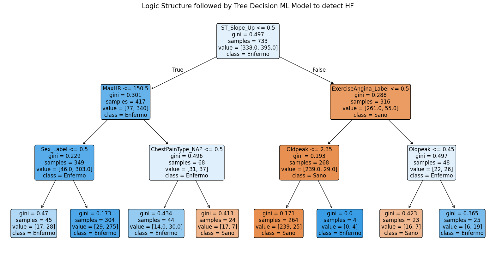
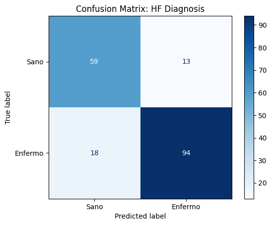

# Heart Failure Prediction using Explainable AI (Decision Trees) 

**Author:** Jesús Jiménez Serrano  
**Field:** Machine Learning / Health Informatics  
**Model:** Decision Tree Classifier (White-Box)

## 1. Project Overview
This project addresses Heart Failure (HF) prediction through the lens of **Explainable AI (XAI)**. Unlike traditional "black-box" models, this study utilizes a **Decision Tree** with limited depth. This ensures that medical professionals can audit and understand the clinical logic behind every diagnosis, fostering trust in AI-assisted systems.

### Why this approach?
* **Interpretability:** We prioritize clinical transparency over pure mathematical optimization.
* **Traceability:** Decision rules emulate the standard medical triage process.
* **Beyond Linear Models:** Captures complex, non-linear patterns that traditional models (like the SHFM) often oversimplify.

## 2. Dataset
The project uses the *Heart Failure Prediction Dataset* from Kaggle (https://www.kaggle.com/datasets/fedesoriano/heart-failure-prediction), which unifies several clinical cohorts.
* **Size:** 918 clinical records.
* **Key Variables:** Age, Cholesterol, Resting Blood Pressure, Exercise ECG (`ST_Slope`, `Oldpeak`), among others.

## 3. Data Preprocessing
* **Data Cleaning:** Median imputation was applied to the `Cholesterol` variable (correcting 18.73% of null/zero values) to preserve statistical power.
* **Encoding:** *Label Encoding* was applied to binary variables, and *One-Hot Encoding* to multi-class variables (such as Chest Pain Type) to avoid artificial hierarchical ordering.
* **Data Split:** 80% Training / 20% Validation.

## 4. Results
* **Final Accuracy:** 83.15% on the test set.
* **Primary Predictor:** The model identified the ST segment slope (`ST_Slope`) as the **root node**, confirming its high clinical significance.
* **Safety Metrics:** Deep analysis of the Confusion Matrix was performed to minimize **False Negatives**, which is critical in a healthcare environment.





## 5. Installation and Usage
1. Clone the repository:
   ```bash
   git clone [https://github.com/your-username/heart-failure-explainable-ai.git](https://github.com/your-username/heart-failure-explainable-ai.git)

2. Install dependencies:
    pip install -r requirements.txt

3. Run the notebook HF_prediction.ipynb in your Jupyter environment or VS Code.